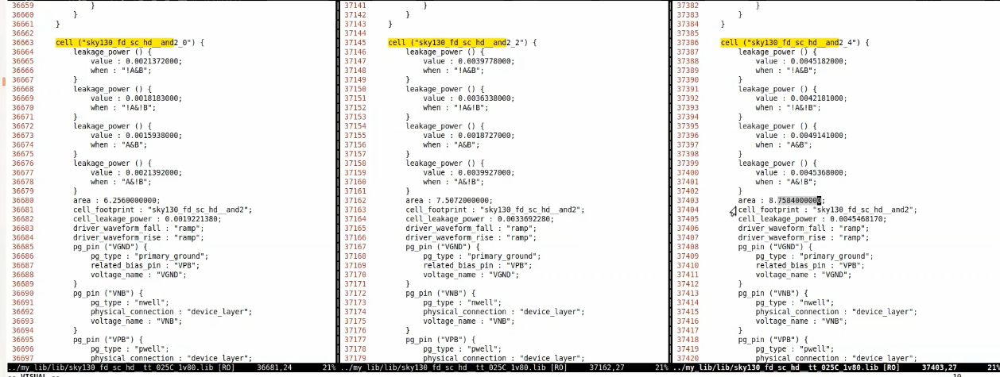

## Day 2 - Timing libs, hierarchical vs flat synthesis and efficient flop coding styles
### Intro to timing .lib files
_Tip: use_ `:syn off` _to disable syntax highlighting in vim editor_

Library Naming convention:

Timing info example for AND2 gate:

Drive strength variation in 2 input AND gate:

### Hierarchical vs Flat Synthesis
Synthesising multiple_modules.v in default mode:

using `flatten` (after synth) to convert hier to flattened netlist:

hier vs flattened netlist:

Synthesising sub module instead of top module:

#### Why synthesize sub-module individually?
- more efficient if multiple instances of same module are present. can synthesize one and instantiate multiple times.

- direct the tool to focus and handle smaller designs if it struggles with top module synthesis directly.

### Flop Coding Styles and optimization

#### Types of flops
- posedge clk with async reset
- posedge clk with async set
- posedge clk with sync reset
- posedge clk with sync set
- negedge clk with async reset
- negedge clk with async set
- negedge clk with sync reset
- negedge clk with sync set

_NOTE:_ sync reset can be thought of muxing the D input with the reset/set value

#### Flops Lab
Different flop types behaviour in waveform:

