# Day 3 - Combinational and sequential optmizations
## Introduction to optimizations

### Combinational op
- direct optimisation
- boolean logic reduction
#### Constant propagation 
It is a type of direct optimisation.

Example:

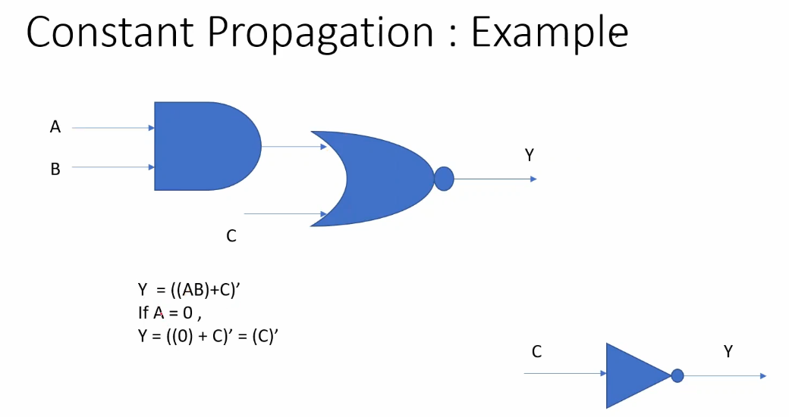

#### Boolean logic optimisaiton

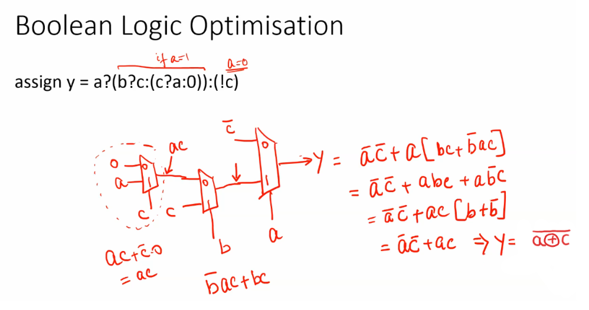

### Sequential op

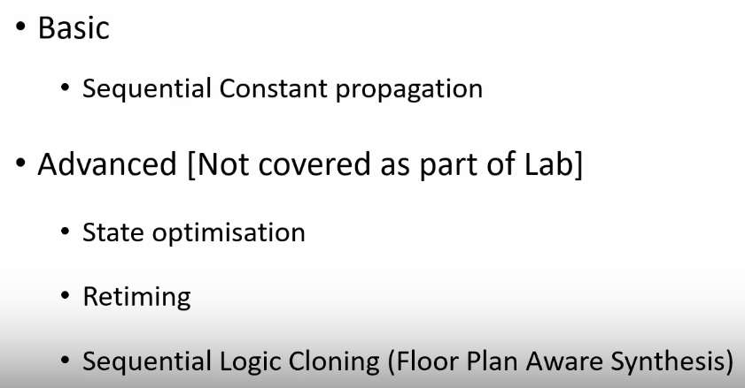

Sequential constant:

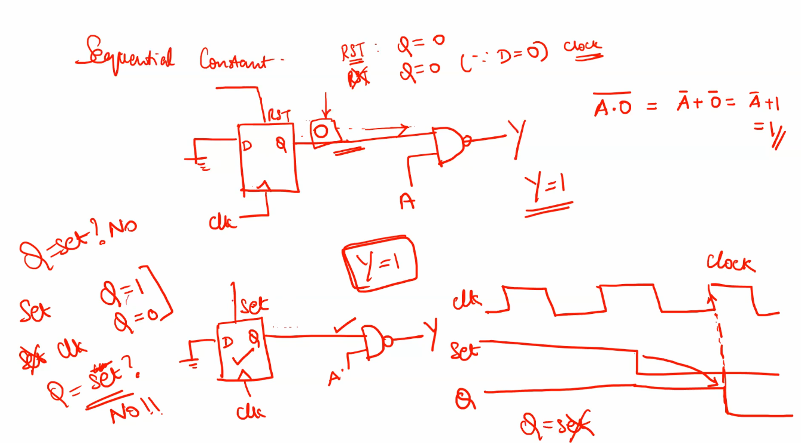

Cloning and retiming:

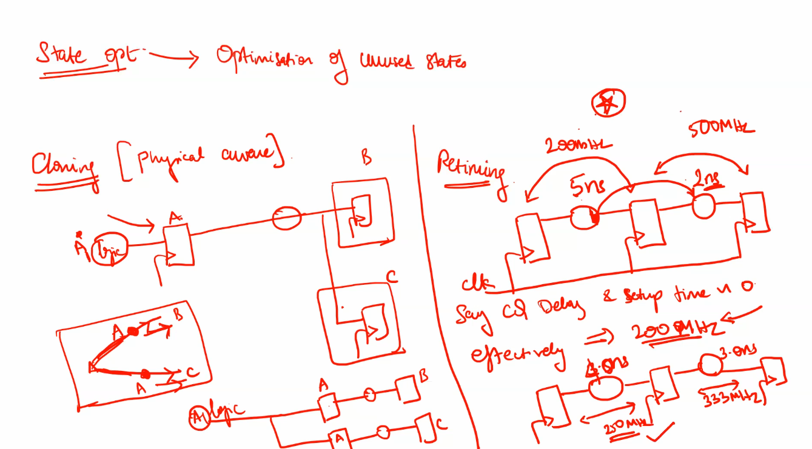

## Optimisations lab 1
### opt_check vs opt_check2
- opt_check - constant 0 propagation in a mux
- opt_check2 - constant 1 propagation in a mux
- opt_check3 - constant propagation in ternary mux eq `y=a?(c?b:0):0`
- opt_check4 - mux eq `y=a?(b?(a&c):c):(!c)`

    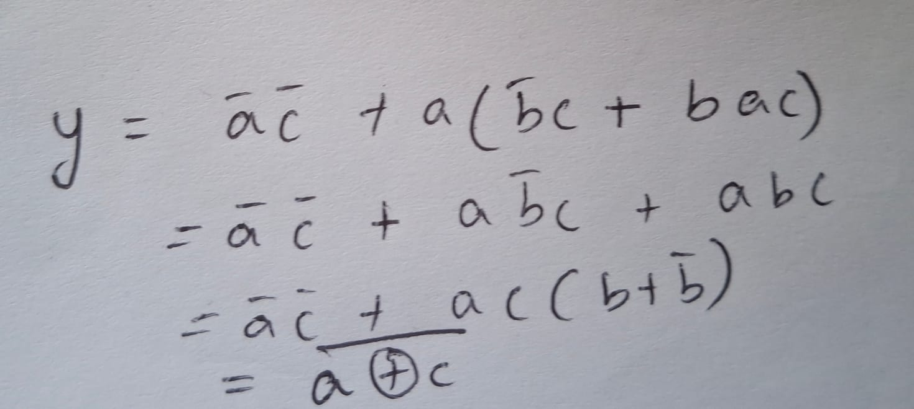

- multiple_module_opt - constant propagation and unused pins in hierarchy
    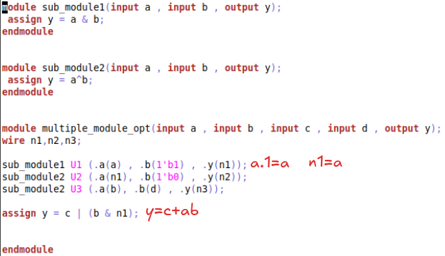

- multiple_module_opt2 - instance pruning and constant propagation
    

#### opt_check synthesis result:

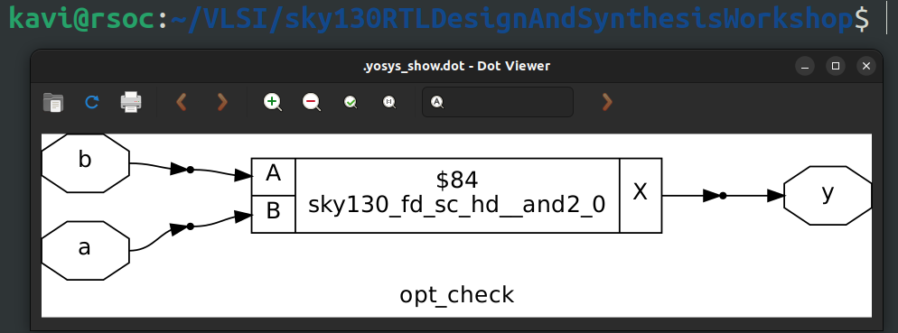

#### opt_check2 synthesis result:

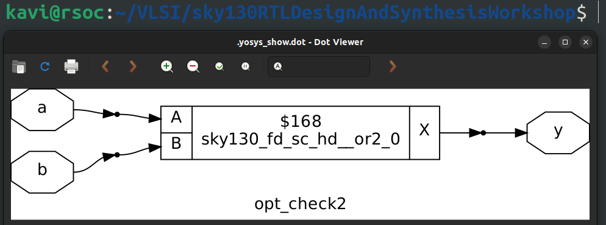

#### opt_check3 synthesis result:

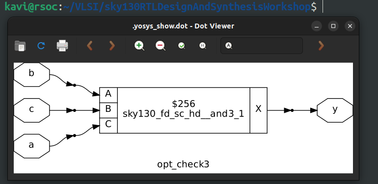

#### opt_check4 synthesis result:

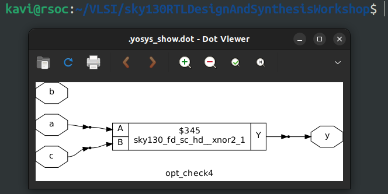

#### multiple_module_opt synthesis result:

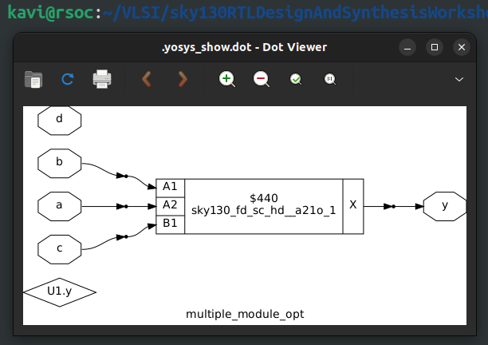

#### multiple_module_opt2 synthesis result:

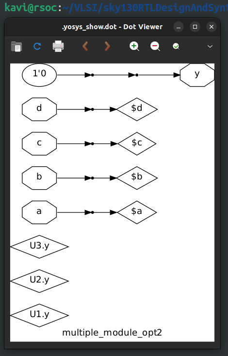
