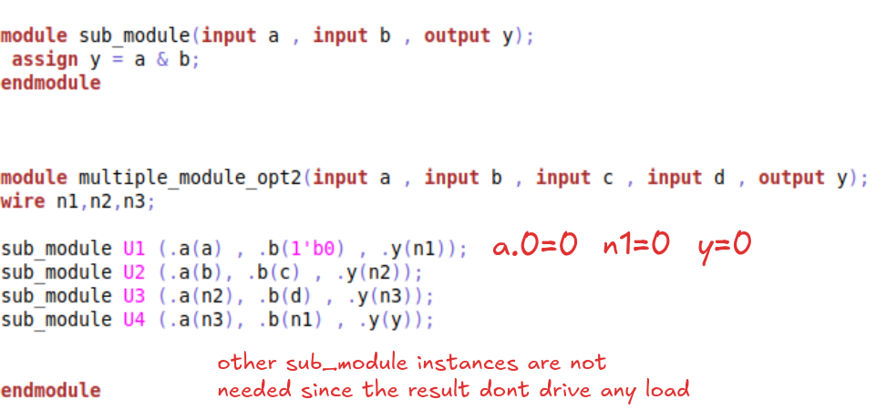

# Day 3 - Combinational and sequential optmizations
## Introduction to optimizations

### Combinational op
- direct optimisation
- boolean logic reduction
#### Constant propagation 
It is a type of direct optimisation.

Example:

#### Boolean logic optimisaiton

### Sequential op

Sequential constant:

Cloning and retiming:

## Lab 1 - combinational Optimisations
### opt_check vs opt_check2
- opt_check - constant 0 propagation in a mux
- opt_check2 - constant 1 propagation in a mux
- opt_check3 - constant propagation in ternary mux eq `y=a?(c?b:0):0`
- opt_check4 - mux eq `y=a?(b?(a&c):c):(!c)` 
    

- multiple_module_opt - constant propagation and unused pins in hierarchy 
    

- multiple_module_opt2 - instance pruning and constant propagation 
    

#### opt_check synthesis result:

#### opt_check2 synthesis result:

#### opt_check3 synthesis result:

#### opt_check4 synthesis result:

#### multiple_module_opt synthesis result:

#### multiple_module_opt2 synthesis result:

## Lab 2 - Sequential optimisations

### dff_const1 
simulation: 

synthesis: 

### dff_const2 
simulation: 

synthesis: 

### dff_const3 
simulation: 

synthesis: 

### dff_const4 
simulation: 

synthesis: 

### dff_const5 
simulation: 

synthesis: 

## unused outputs optimisation
This optimisation involves identifying and removing parts of a digital circuit's logic that do not contribute to its final function or output, thereby reducing circuit complexity, saving power, and minimizing the silicon area required for the design.