# Day 4 - GLS, blocking vs non-blocking and Synthesis-Simulation mismatch
## GLS, Synthesis-Simulation mismatch and Blocking/Non-blocking statements
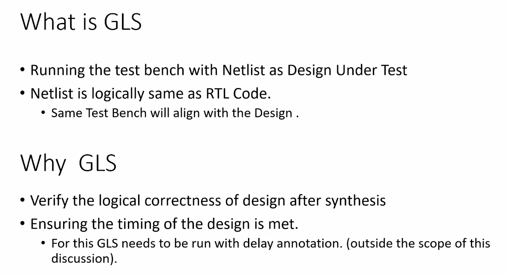
 
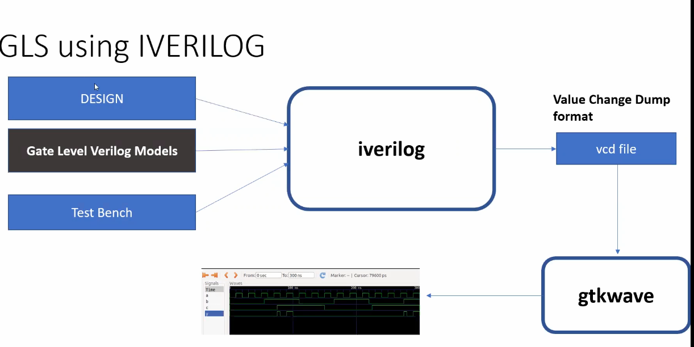
 
NOTE: if the gate level models are delay annotated, the GLS can be used for timing validation.
 
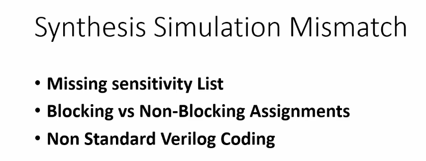
 

### synthesis simulation mismatch
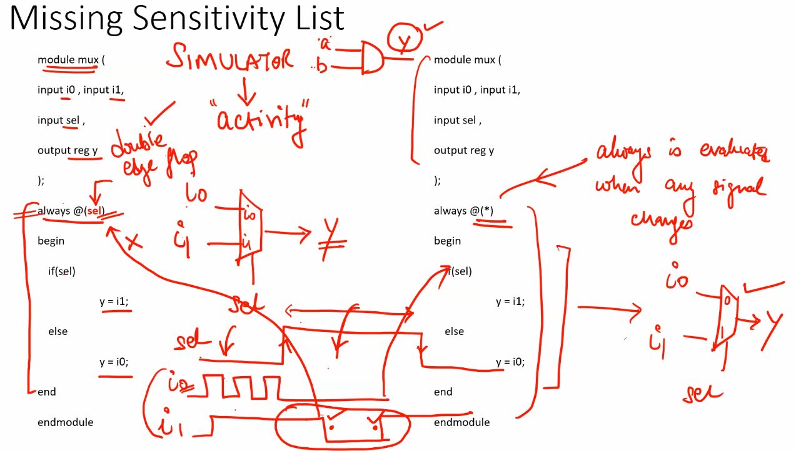
 
Left RTL infers a double edge flop during simulation  
Right RTL infers a mux during simulation  
Synthesis doesnt consider sensitivity list; infers mux both times

### Blocking And NonBlocking Statements In Verilog
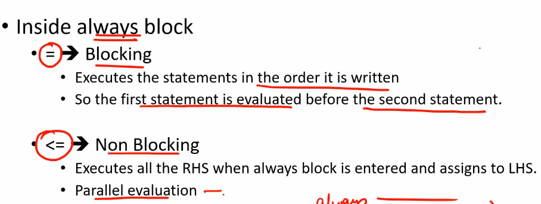
 
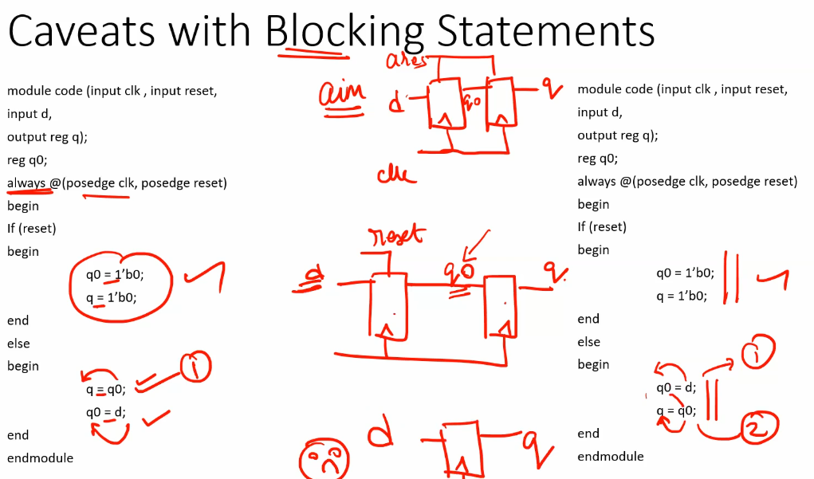
 
always use non blocking statements when assigning sequential elements
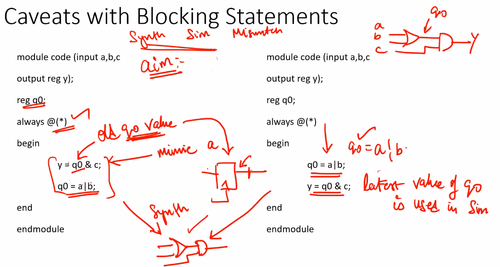

 

Left RTL infers a 1 cycle delay for the reg value  
Right RTL infers same cycle output  
synthesis doesnt care about the order of blocking statements, infers same cycle output  

## Lab - sensitiivity list

### ternary_operator_mux
Simulation:
 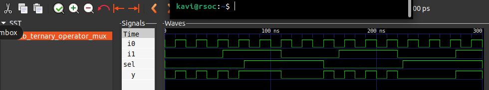 
Synthesis:
 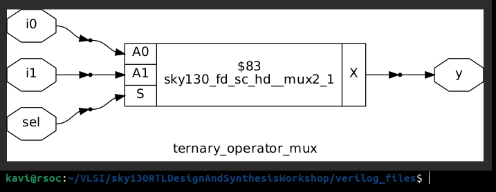 
GLS:
 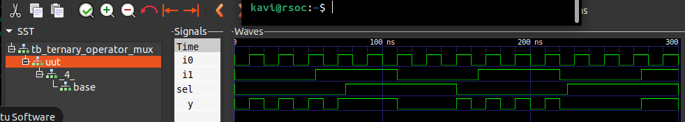 

### bad_mux
RTL simulation and GLS:
 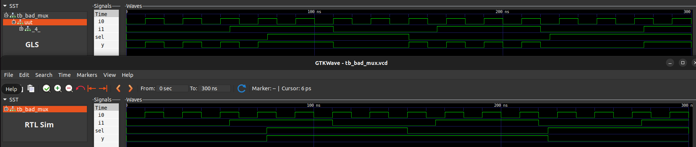 
Synthesis:
 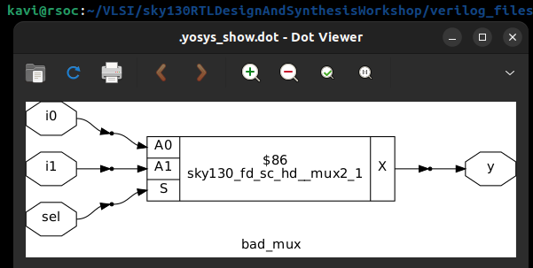 

## Lab - blocking and non blocking
RTL simulation and GLS:
 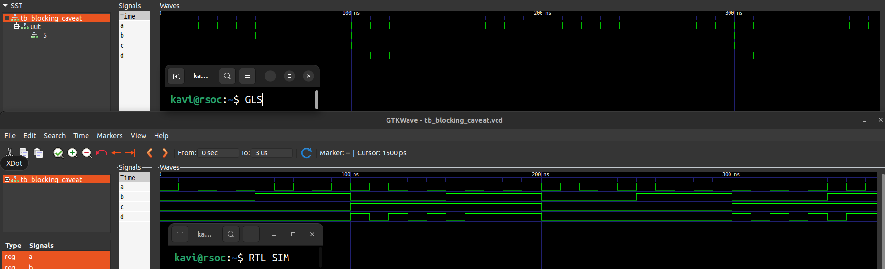 
Synthesis:
 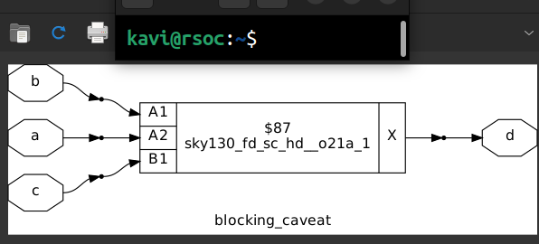 