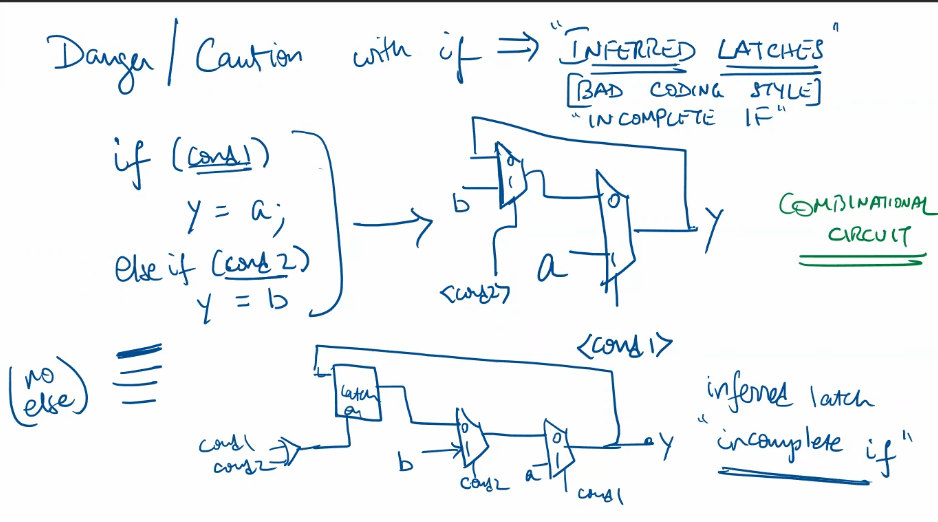
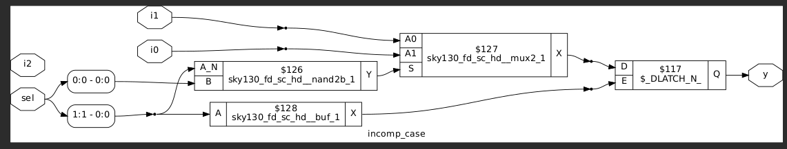
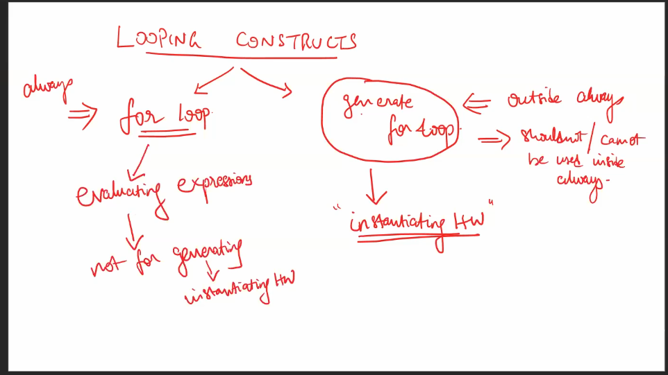

# Day 5 - Optimization in synthesis
## `if`, `case` constructs
Priority logic:
  

Inferred latch -  incomplete else in if
  
  

Case:
  
  
  
  

## Lab - `if`
### incomp_if:
Simulation:
  
Synthesis:
  

### incomp_if2:
Simulation:
  
Synthesis:
  

## Lab - `case`
### incomp_case :
Simulation:
  
Synthesis:
  
### comp_case:
Simulation:
  
Synthesis:
  
### partial_case_assign:
Simulation:
  
Synthesis:
  

### bad_case:
Simulation and GLS:
  
Synthesis:
  

## For Loop and For Generate

## Lab - `for` and `for generate`

### mux_generate
Simulation:
  

GLS:
  

Synthesis:
  

### demux_case
Simulation:
  
GLS:
  
Synthesis:
  

### demux_generate
Simulation:
  
GLS:
  
Synthesis:
  

### rca
Simulation:
  
GLS:
  
Synthesis:
  